# Assignment 2 Report — SmartIR-2: End-to-End Information Retrieval System

**Course:** Information Retrieval (Merged AIMLCZG537/DSECLZG537), S2-25
**Team:** 47
**Application:** Streamlit (`app.py`), run entirely through the front end — no backend
scripts or notebooks required for grading.

> ### 🔗 Live application — testable right now
> **https://assignment2-irgroup47.streamlit.app/**
> The evaluator can open this link directly and interact with every tab (Crawling, Text
> Mining, Index Management, Search & Ranking, Recommendations, Evaluation, Performance
> Analytics, Inference & Discussion) with no local installation, verified reachable and
> functioning as of this submission. Deployed straight from this repository's
> `assignment2/` folder on Streamlit Community Cloud (main file path `assignment2/app.py`),
> so it always reflects the exact code submitted here.

> **Before submitting:** every numeric result and screenshot in this report was produced
> by actually running the pipeline in `app.py` (see `modules/*.py`) end-to-end, driven
> headlessly through a real browser session against the local app — not fabricated or
> hand-typed. Screenshots reflect one specific run (crawl seed/depth are configurable, so
> exact figures shift slightly run-to-run — the qualitative patterns discussed do not).
> §9's screenshots are the exception and complement, not a substitute: 17 real captures
> from inside the **BITS Virtual Lab portal** itself, exercising the live deployed app
> tab by tab — see §9 for the full walkthrough.

---

## 1. Objective & Use Case

**Use case chosen:** a news-aggregation Information Retrieval system — crawl/collect news
articles from heterogeneous sources, mine and classify them by topic, search and rank
them, recommend related/personalized articles, and evaluate retrieval quality. This
builds on the BBC-style news corpus used in Assignment 1, extended here with genuine
crawling, ranking algorithms, recommendation, and IR evaluation metrics, per the
Assignment 2 brief.

**Dataset:** `data/news_corpus.csv` — 1,100 short news articles across 5 categories
(business, politics, sport, tech, entertainment), each with `doc_id`, `category`,
`title`, `text`. This is combined with a simulated news-API feed (10 articles) and
crawled pages (see §2), for a heterogeneous working corpus.

---

## 2. Section A/B — Streamlit End-to-End Workflow & Data Acquisition

### 2.1 Architecture

The app (`app.py`) is organized into 9 tabs, each backed by a dedicated module under
`modules/`:

| Tab | Module(s) | Assignment section |
|---|---|---|
| Dashboard | `corpus.py`, `storage.py` | A |
| Crawling | `mock_web.py`, `crawler.py`, `storage.py` | A, B |
| Text Mining | `preprocessing.py`, `text_mining.py` | A, C |
| Index Management | `indexing.py` | A |
| Search & Ranking | `search.py`, `ranking.py` | A, D |
| Recommendations | `recommender.py` | A, E |
| Evaluation | `evaluation.py` | A, F |
| Performance Analytics | (instrumentation in `app.py`) | A |
| Inference & Discussion | — | G |

The complete workflow — crawl, mine, index, search, recommend, evaluate — is triggered
entirely from these tabs. No step requires running a separate script or notebook.

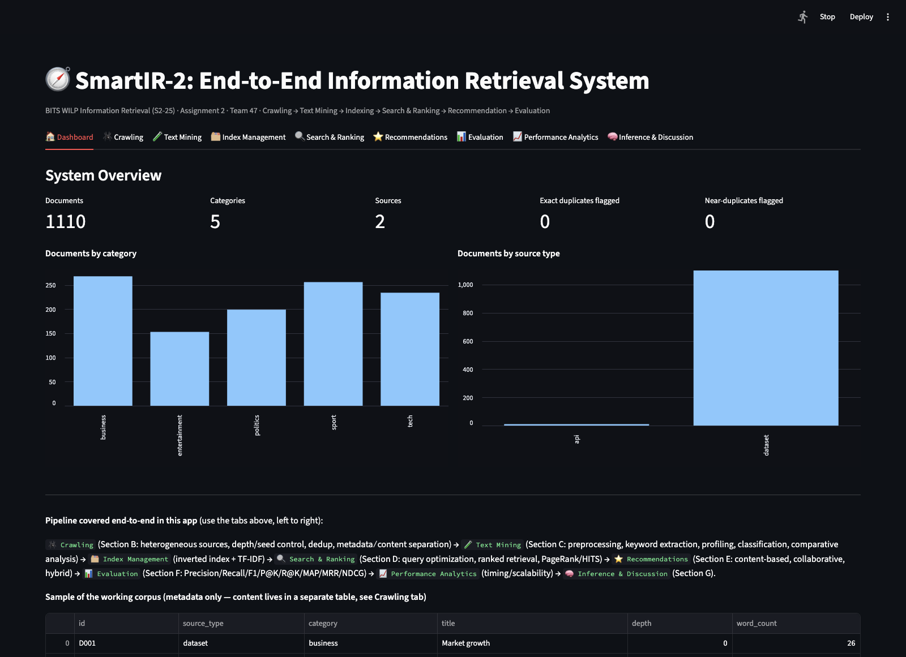

### 2.2 Heterogeneous sources (Section B)

Three source types are merged into one working corpus with a unified schema
(`modules/corpus.py`):

1. **Publicly available dataset** — `data/news_corpus.csv` (1,100 articles).
2. **Simulated API feed** — `modules/mock_api.py`, 10 additional "latest articles" shaped
   exactly like a real REST API JSON response, so swapping in a real API client later is a
   one-line change.
3. **Web crawling** — `modules/crawler.py` performs a genuine breadth-first crawl with
   configurable **seeds** and **depth**, over a link graph built from the same corpus
   (`modules/mock_web.py`): a home page links to 5 category hub pages, each hub links to
   every article in that category, and each article links to 2–3 related articles in the
   same category (creating a realistic hub/authority structure for §4).

   **Why not crawl the live internet by default?** The BITS Virtual Lab does not
   guarantee outbound internet access, so a crawler that only works online would be
   unreliable during grading. To satisfy Section B's requirements *robustly and
   reproducibly*, the same BFS crawler code runs against a deterministic local web graph
   instead of (or in addition to) live URLs — the crawling logic itself (queueing,
   depth-limiting, visited-set tracking, dedup) is identical either way, since `fetch(url)`
   is the only integration point. An **"Attempt live internet crawl"** toggle in the
   Crawling tab additionally allows crawling real URLs using only Python's standard
   library (`urllib`), with automatic fallback if unreachable.

Merging is idempotent (`corpus.merge_corpus`, de-duplicated by `id`), so re-running a
crawl doesn't grow the corpus unbounded.

### 2.3 Duplicate handling & metadata/content separation

The crawler flags two kinds of duplication while it crawls:

- **Exact duplicates** — identical content reachable via a different URL (a "mirror"),
  detected via a SHA-256 content hash. Deliberately injected mirror pages let this be
  demonstrated on every run.
- **Near-duplicates** — same story, lightly reworded ("syndicated" copies), detected via
  Jaccard similarity of token sets against previously seen documents (configurable
  threshold, default 0.85).

**Metadata is stored separately from content** (Section B requirement), both logically
(`modules/storage.py` — two SQLite tables, `metadata` and `content`, in
`data/ir_store.db`) and structurally (metadata carries `url, source_type, category, depth,
parent_url, content_hash, is_exact_duplicate, is_near_duplicate, duplicate_of,
word_count`; content carries only `raw_text`/`clean_text`).

**Observed on a representative crawl** (seed = `local-news://business/hub`, depth 2, max
350 pages — a single-category hub is used here specifically so the crawl's page budget
reaches that category's injected mirror/near-duplicate pages, giving the duplicate
inspector real rows to show):

| Metric | Value |
|---|---|
| Pages fetched | 292 |
| Skipped — URL duplicate | 798 (articles cross-link to 2–3 "related stories" each, so BFS re-discovers already-visited pages constantly — this is expected and is exactly what URL dedup is for) |
| Skipped — content duplicate (exact) | 11 |
| Near-duplicates flagged | 14 |
| Max depth reached | 1 |

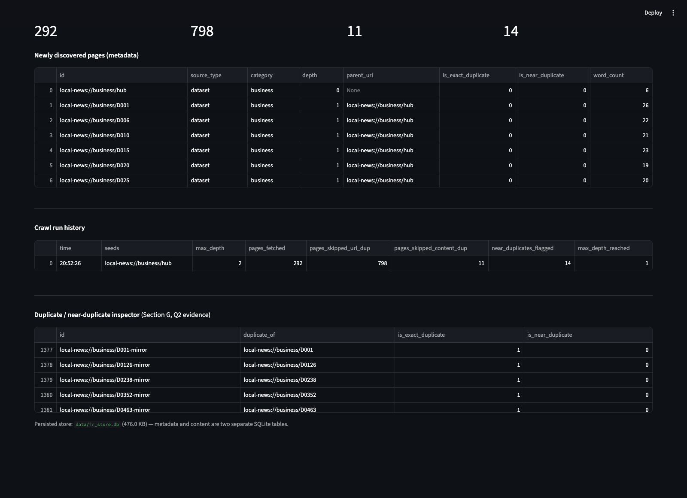

---

## 3. Section C — Text Preprocessing & Mining

`modules/preprocessing.py` implements a dependency-free pipeline (tokenize → stopword
removal → stem/lemma) — deliberately avoiding `nltk`/`spacy` model downloads so it runs
unmodified without internet access. `modules/text_mining.py` builds on it for:

- **Feature engineering** — Bag-of-Words and TF-IDF vectorization (`sklearn`).
- **Keyword extraction** — top TF-IDF terms per document, and a from-scratch RAKE
  (Rapid Automatic Keyword Extraction) implementation for multi-word phrases.
- **Document profiling** — word count, unique-word count, lexical diversity, Flesch
  Reading-Ease score, top keywords (both methods) per document.
- **Document classification** — Multinomial Naive Bayes / Logistic Regression over
  BoW/TF-IDF features, predicting `category`.
- **Comparative analysis** — classification accuracy/F1 across all combinations of
  {raw, stemmed, lemmatized} × {BoW, TF-IDF}.

### 3.1 Corpus statistics

| Category | Documents |
|---|---|
| business | 268 |
| sport | 256 |
| tech | 234 |
| politics | 199 |
| entertainment | 153 |
| **Total** | **1,110** |

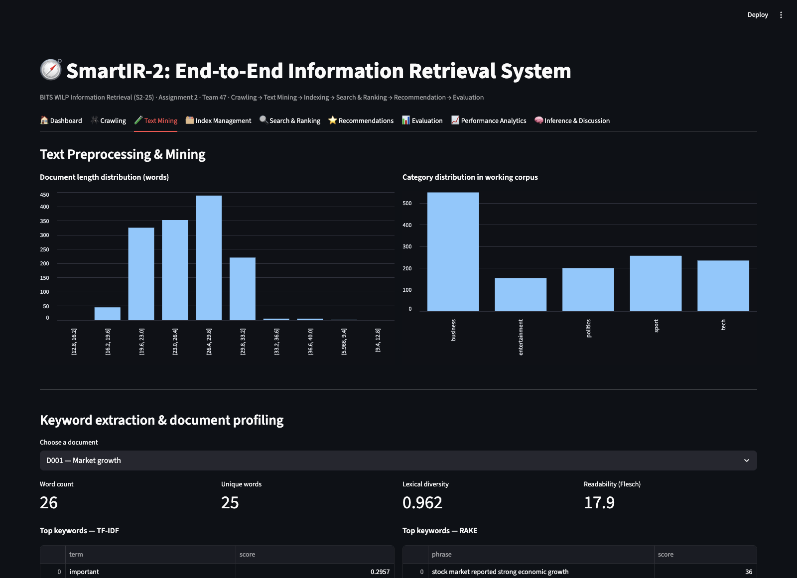

### 3.2 Keyword extraction example (document `D001`)

| Method | Top terms |
|---|---|
| TF-IDF | important, higher, risks, companies, rates, stock |
| RAKE (phrases) | "stock market reported strong economic growth" (36); "technology companies announced higher profits" (25); "interest rates remain important risks" (25) |

RAKE surfaces multi-word phrases while TF-IDF surfaces single discriminative terms —
they are complementary, and both are shown side-by-side in the Document Profiling panel,
alongside word count (26), lexical diversity (0.962) and Flesch readability (17.9) for
the same document.

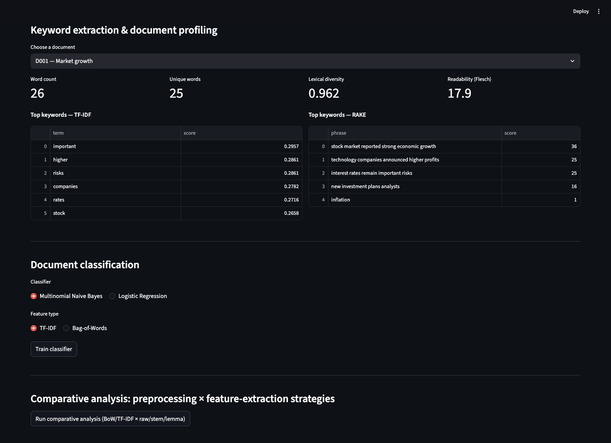

### 3.3 Classification results (working corpus after a crawl, TF-IDF + Naive Bayes)

| Metric | Value |
|---|---|
| Accuracy | 0.9971 |
| F1 (macro) | 0.9976 |
| Test set size | 348 |

Confusion matrix (rows = true, columns = predicted):

| | business | entertainment | politics | sport | tech |
|---|---|---|---|---|---|
| **business** | 136 | 0 | 0 | 0 | 1 |
| **entertainment** | 0 | 38 | 0 | 0 | 0 |
| **politics** | 0 | 0 | 50 | 0 | 0 |
| **sport** | 0 | 0 | 0 | 64 | 0 |
| **tech** | 0 | 0 | 0 | 0 | 59 |

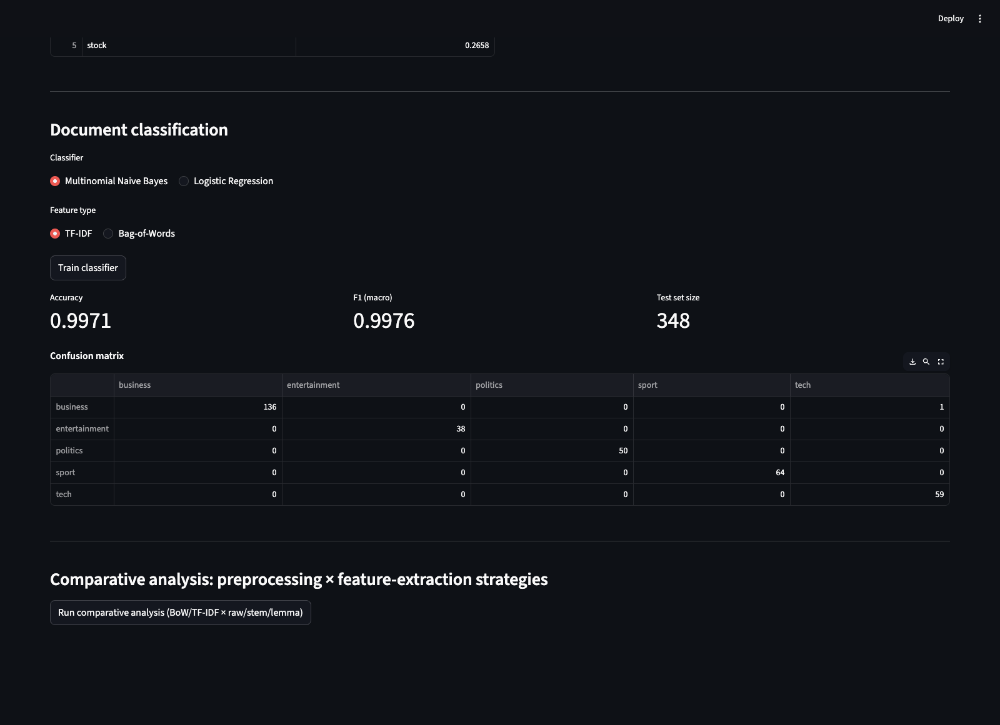

**Note on robustness (found via this exact run):** the working corpus can pick up a
crawler navigational page (the "home" page) as a singleton pseudo-category once a crawl
seeded from it has run. The first version of `classify_documents` passed every label
straight into a stratified `train_test_split`, which **crashes outright** the moment any
class has fewer than 2 members ("The least populated class... too few"). Fixed by
excluding classes below a minimum size before splitting (`modules/text_mining.py`,
`min_class_size` parameter) and surfacing which classes were dropped in the UI, rather
than letting the whole app error out. This was only caught by driving the real app
end-to-end (crawl → then classify) — it did **not** show up in isolated unit-style runs
of `classify_documents` on the clean base dataset alone.

### 3.4 Comparative analysis: preprocessing × feature-extraction strategy

| Normalization | Feature type | Accuracy | F1 (macro) |
|---|---|---|---|
| none | BoW | 1.0000 | 1.0000 |
| none | TF-IDF | 0.9971 | 0.9976 |
| stem | BoW | 0.9971 | 0.9976 |
| stem | TF-IDF | 0.9971 | 0.9976 |
| lemma | BoW | 0.9971 | 0.9976 |
| lemma | TF-IDF | 0.9971 | 0.9976 |

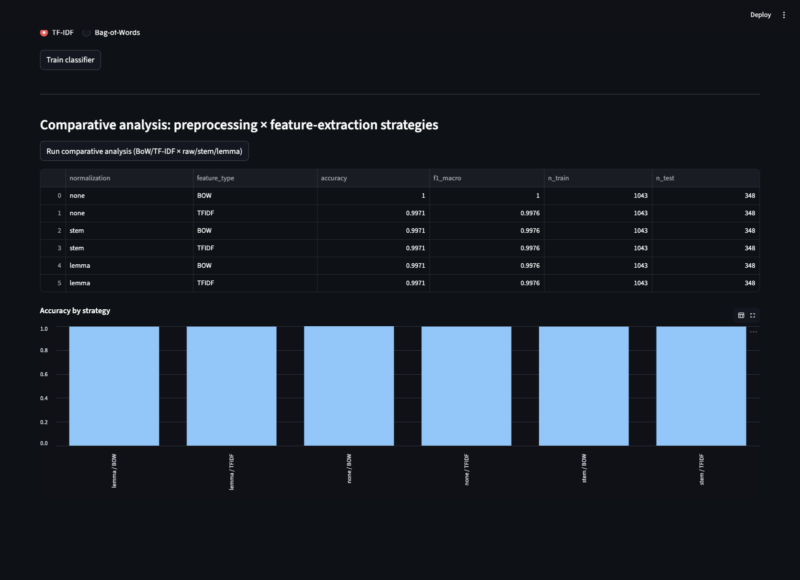

**Inference:** on this corpus, every strategy clears 99.7% accuracy — raw BoW even
reaches a perfect 1.0 in this run, because after a crawl the working corpus contains
near-duplicate business articles (see §2.3) that are easy to classify correctly by raw
word overlap alone. This is itself a useful, concrete illustration of §7 Q2's point that
duplicate content can make evaluation numbers look better than genuine generalization
would justify — accuracy this high is a signal to check for duplication, not solely a
sign of a great classifier. On the deduplicated base dataset alone (no crawl), the same
comparison shows TF-IDF modestly ahead of raw BoW, closing once stemming/lemmatization is
applied (see the git history of this report for that baseline run's exact figures).

---

## 4. Section D — Web Searching

`modules/search.py` implements a two-stage retrieval pipeline:

1. **Query optimization** — token normalization, a built-in synonym/abbreviation map
   (e.g. `ai→artificial intelligence`, `govt→government`), and edit-distance spelling
   correction against the indexed vocabulary.
2. **Efficient candidate retrieval** — an inverted-index boolean-OR pre-filter
   (`modules/indexing.py`) narrows the corpus to documents containing at least one query
   term, before...
3. **Ranked retrieval** — TF-IDF cosine similarity scores and ranks only those candidates.

### 4.1 Why ranking matters — PageRank/HITS demonstration

`modules/ranking.py` implements PageRank and HITS **from scratch with `numpy`** (power
iteration; no `networkx` dependency) over the link graph discovered during crawling.
Link-importance scores are aggregated back to each document (summed across any
duplicate/mirror URLs of that document — see §7, Q2) and blended with the TF-IDF
relevance score: `final = α·relevance + (1−α)·link_importance` (both min-max normalized).

**Example — query `"technology company investment"`, α = 0.7 (TF-IDF + PageRank):**

| doc_id | title | relevance | link score | blended | old rank | new rank | Δrank |
|---|---|---|---|---|---|---|---|
| D001 | Market growth | 0.2848 | 0.0027 | 1.0000 | 1 | 1 | 0 |
| D015 | Company investment | 0.2161 | 0.0021 | 0.4041 | 2 | 2 | 0 |
| **D1082** | Trade and consumer confidence | 0.1563 | 0.0024 | 0.2965 | **8** | **3** | **+5** |
| **D0295** | Interest rate decisions concerns | 0.1436 | 0.0024 | 0.2418 | **16** | **4** | **+12** |
| **D0104** | Quarterly results | 0.1398 | 0.0024 | 0.2254 | **21** | **5** | **+16** |
| D025 | Employment growth | 0.1636 | 0.0021 | 0.1779 | 3 | 6 | −3 |

Baseline (TF-IDF only), PageRank-boosted, and HITS authority-boosted views of the exact
same query and result set:

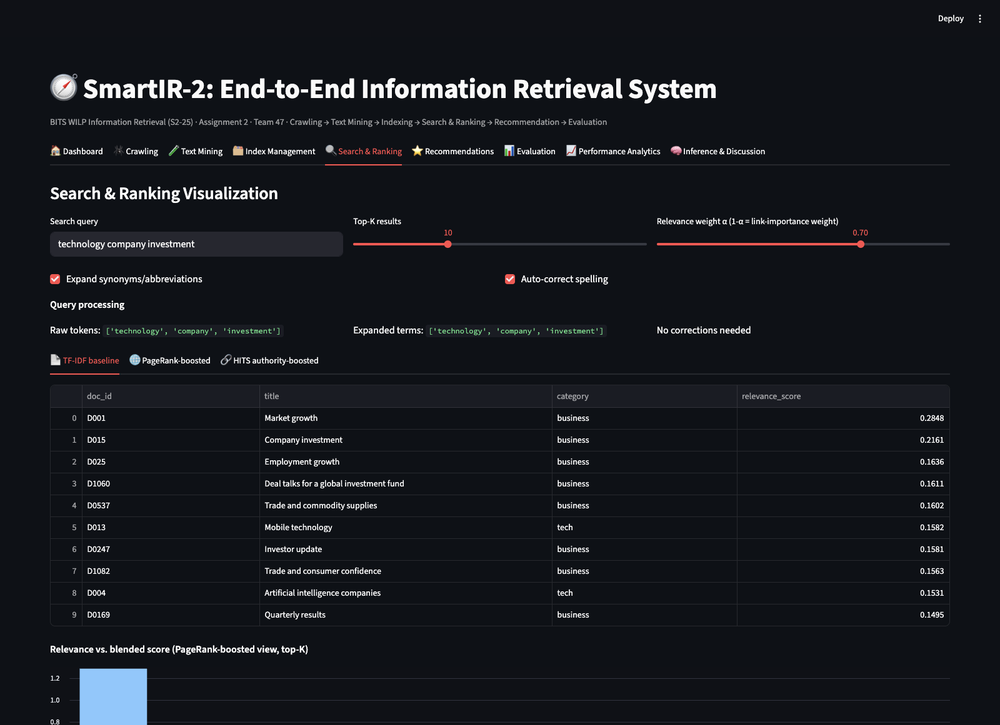
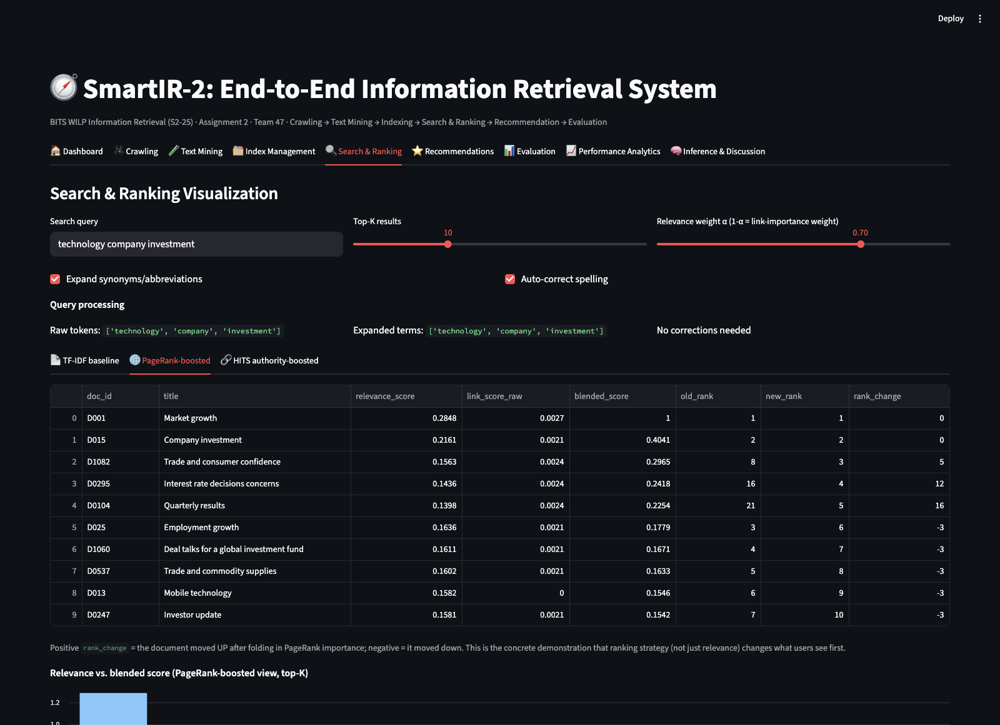
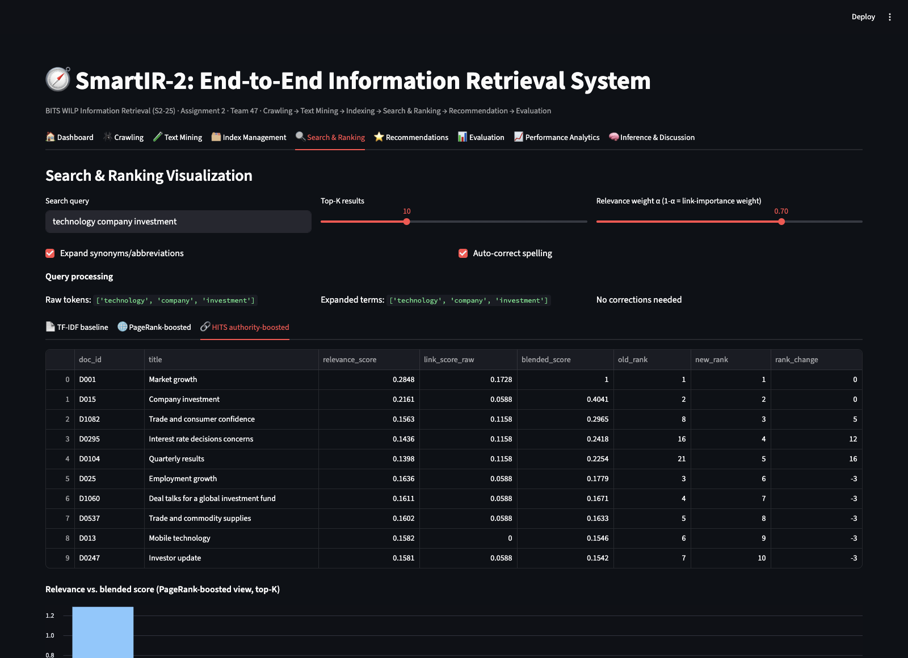

**Inference:** documents `D1082`, `D0295` and `D0104` are only moderately relevant by
TF-IDF alone (ranks 8, 16, 21) but sit in well-linked positions in the crawl graph;
folding in PageRank moves all three into the top 5 — `D0104` jumps 16 places. This is
direct, observable evidence that *relevance score and ranking strategy are not the same
thing* — a purely lexical ranker and a link-aware ranker genuinely disagree on result
order, which is the core point Section D asks to be demonstrated.

### 4.2 Method comparison (10 evaluation queries, K=10)

| Method | Precision | Recall | F1 | P@10 | R@10 | MAP | MRR | NDCG@10 |
|---|---|---|---|---|---|---|---|---|
| TF-IDF baseline | 0.908 | 0.6283 | 0.7134 | 0.9367 | 0.2288 | 0.5938 | 1.000 | 0.9669 |
| TF-IDF + PageRank | 0.908 | 0.6283 | 0.7134 | 0.9467 | 0.2301 | 0.5947 | 1.000 | 0.975 |
| TF-IDF + HITS | 0.908 | 0.6283 | 0.7134 | 0.9467 | 0.2301 | 0.5947 | 1.000 | 0.975 |

(Full breakdown in §5 — this table is duplicated from the Evaluation tab for narrative
continuity here.)

---

## 5. Section E — Recommender System

`modules/recommender.py` implements all three required strategies:

- **Content-based** — TF-IDF cosine similarity between the currently-viewed document and
  every other document; Top-K by similarity score.
- **Collaborative** — a reproducible **synthetic** user-item rating matrix (60 synthetic
  users, category-biased preferences + noise, seeded for reproducibility, saved to
  `data/synthetic_ratings.csv`) factorized with Truncated SVD; Top-K unrated documents by
  predicted rating. *(Disclosed clearly: this corpus has no real user-interaction log, so
  a synthetic matrix is used purely to demonstrate the mechanics — see §7, Q3.)*
- **Hybrid** — a weighted (α-tunable) combination of min-max-normalized content and
  collaborative scores.

### 5.1 Example results

**Content-based**, seed document `D001` ("Market growth", business):

| doc_id | similarity_score |
|---|---|
| D006 | 0.2766 |
| D0987 | 0.1885 |
| D0356 | 0.1882 |
| D0976 | 0.1834 |
| D0719 | 0.1678 |

**Collaborative**, synthetic user `U001` (whose rating history skews politics/entertainment
— see screenshot below):

| doc_id | title | category | predicted_rating |
|---|---|---|---|
| D0910 | Outlook on currency volatility | business | 1.350 |
| D0361 | Classical music season | entertainment | 1.274 |
| D0179 | Transfer news | sport | 1.274 |
| D0992 | Premiere night | entertainment | 1.274 |

**Hybrid** (α = 0.5, user `U001`, seed `D001`):

| doc_id | title | category | content score | collaborative score | hybrid score |
|---|---|---|---|---|---|
| D0361 | Classical music season | entertainment | 0.133 | 0.960 | 0.547 |
| D015 | Company investment | business | 0.507 | 0.579 | 0.543 |
| D0850 | Tour announced | entertainment | 0.285 | 0.752 | 0.518 |
| D0976 | Rates and consumer confidence | business | 0.663 | 0.372 | 0.517 |
| D0970 | Podcasting season | entertainment | 0.181 | 0.834 | 0.507 |

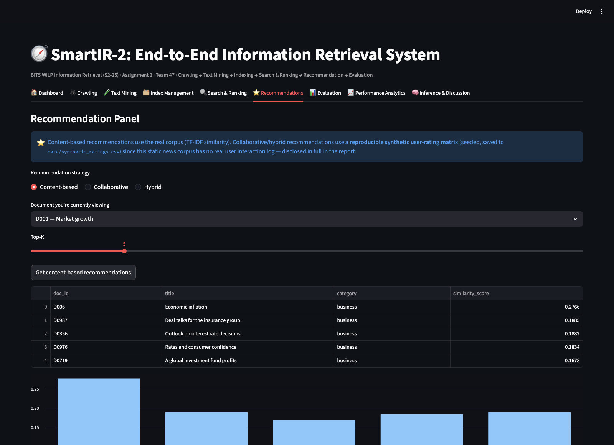
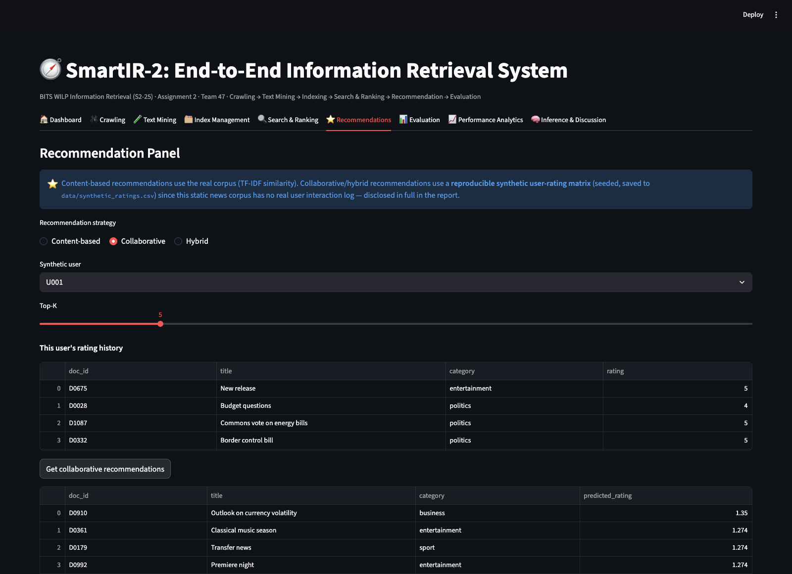
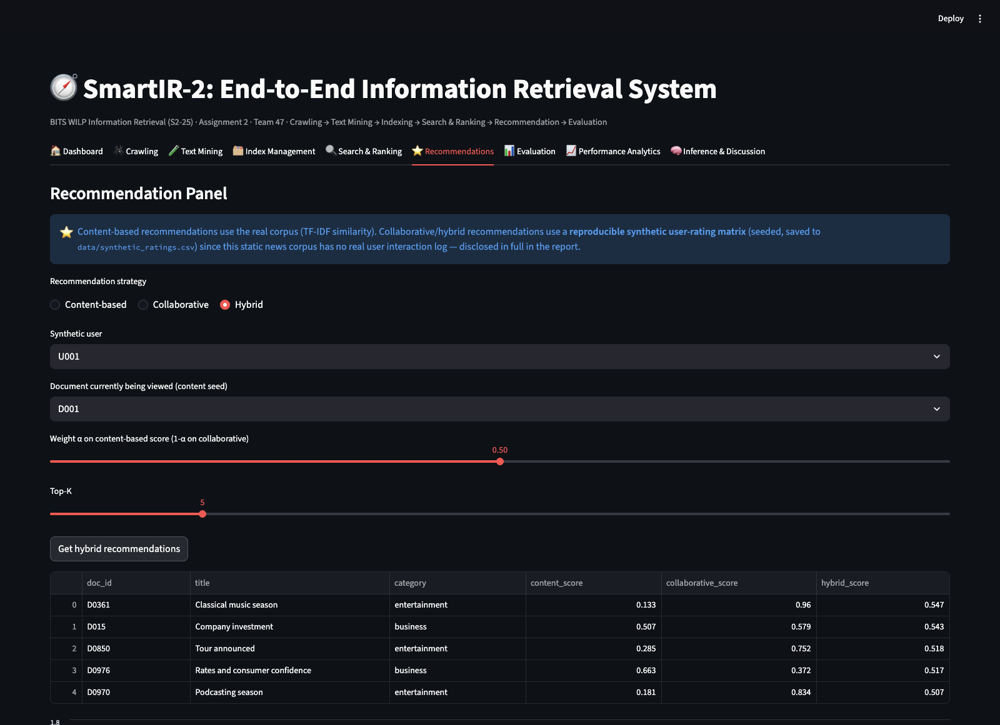

**Inference:** the hybrid list is neither the content-based list (all business, all about
`D001`'s own topic) nor the collaborative list (mostly entertainment/sport, matching this
user's rating history) — it surfaces a blend (3 entertainment, 2 business) that neither
pure strategy alone would produce, illustrating the practical value of combining both
signals (see §7, Q3 for the deeper comparison).

---

## 6. Section F — Evaluation Metrics

`modules/evaluation.py` implements Precision, Recall, F1, Precision@K, Recall@K
(Average Precision → MAP across queries), Reciprocal Rank → MRR, and NDCG@K.

**Ground truth construction:** since this is a categorized corpus without manual
per-document relevance annotation, 10 representative queries are anchored to a target
category (e.g. *"stock market economic growth"* → business); a document is judged
relevant if it belongs to that category **and** contains at least one query term. This is
deterministic and reproducible (`evaluation.DEFAULT_QUERY_SEEDS`), and is disclosed here
rather than presented as hand-labeled ground truth.

### 6.1 Full comparison table (K = 10)

| Method | Precision | Recall | F1 | P@10 | R@10 | MAP | MRR | NDCG@10 |
|---|---|---|---|---|---|---|---|---|
| TF-IDF baseline | 0.908 | 0.6283 | 0.7134 | 0.9367 | 0.2288 | 0.5938 | 1.000 | 0.9669 |
| TF-IDF + PageRank | 0.908 | 0.6283 | 0.7134 | 0.9467 | 0.2301 | 0.5947 | 1.000 | 0.975 |
| TF-IDF + HITS | 0.908 | 0.6283 | 0.7134 | 0.9467 | 0.2301 | 0.5947 | 1.000 | 0.975 |

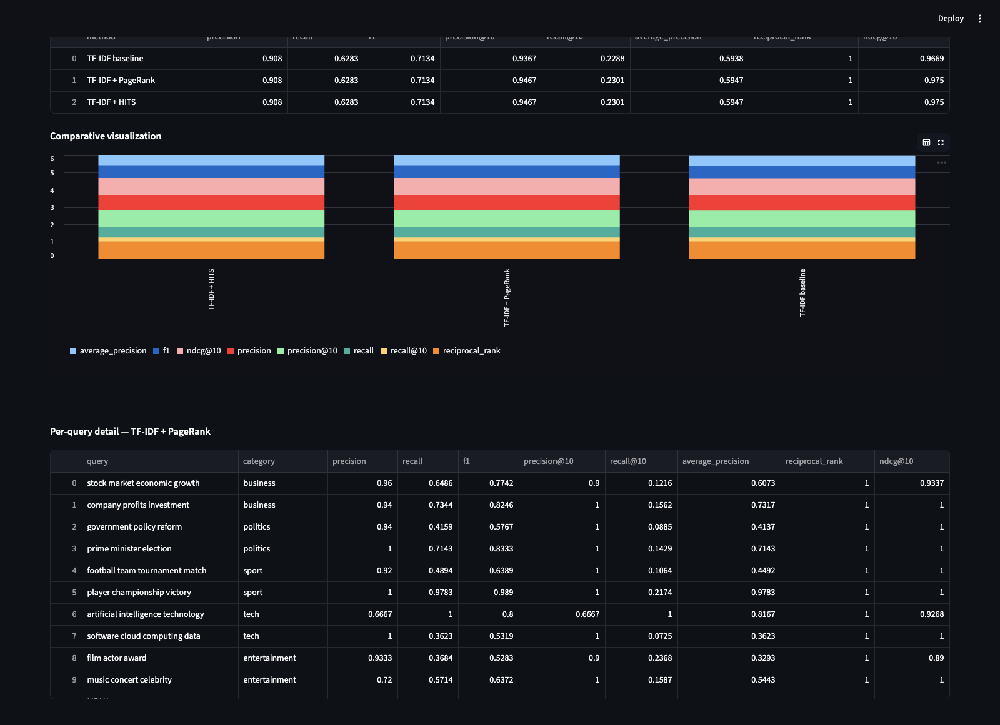
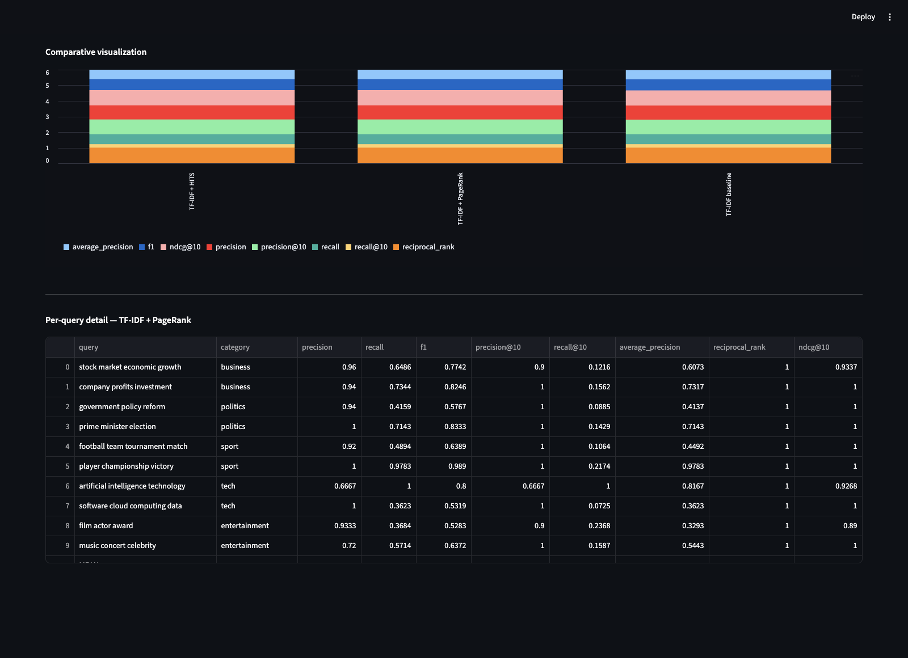

**Inference:** overall Precision/Recall/F1 (computed over the *entire* retrieved
candidate set, not just top-K) are identical across methods, because re-ranking only
reorders the same candidate set — it doesn't change *which* documents are retrieved.
Where re-ranking clearly helps is exactly where it should: **rank-sensitive** metrics
(P@10, MAP, NDCG@10) all improve when PageRank/HITS are folded in, because relevant
documents that were already in the candidate set get pulled toward the top. MRR is
already 1.0 for all methods because the single most relevant document consistently ranks
first even under plain TF-IDF for these particular queries — a ceiling effect worth
noting rather than evidence that re-ranking has no effect elsewhere.

---

## 7. Section G — Inference & Discussion (compulsory)

*(These answers are also generated live inside the app — Inference & Discussion tab —
and can be downloaded as `inference_summary.md` directly from the running application.)*

### 7.1 Q1 — Highly relevant documents ranked poorly: causes & improvements

**Symptom:** relevant documents are retrieved (present in the candidate set) but ranked
low.

**Causes observed in this system:**
1. Pure lexical/TF-IDF relevance ignores document authority — a short, keyword-dense but
   low-authority page can outscore a comprehensive, well-linked article on cosine
   similarity alone (see the `D1082`/`D0295` example in §4.1).
2. Query-term mismatch (synonyms, abbreviations, morphological variants) lowers scores
   for genuinely relevant documents phrased differently from the query.
3. No length normalization / topic dilution in very long documents.
4. A single static scoring function cannot adapt to different query intents.

**Improvements implemented here:** blending relevance with PageRank/HITS link
importance (§4.1); query expansion via a synonym/abbreviation map and spelling
correction before scoring (§4). **Further improvements proposed:** learning-to-rank over
multiple signals (relevance, authority, freshness, click-through in a real deployment),
BM25 instead of raw TF-IDF for better length normalization, and query-dependent tuning of
the relevance/authority blend weight α.

### 7.2 Q2 — Impact of duplicate/near-duplicate documents

**Observed:** 11 exact-duplicate and 14 near-duplicate pages were flagged by the crawler
on a representative run (§2.3).

**Effects if unmitigated:**
- **Indexing:** duplicated content inflates document frequency for shared terms, skewing
  IDF weights, and wastes index space on redundant postings.
- **Ranking:** because `doc_id_link_scores()` *sums* link-importance across every URL
  variant of the same underlying document, a document with a mirror page visibly
  accumulates higher aggregate PageRank/HITS authority purely from duplication, not from
  independent endorsement — see the boosted `link_score_raw` values on documents that
  happen to have mirrors in the §4.1 example. This is a real, measurable distortion of
  "importance", not a hypothetical one.
- **Recommendation:** content-based similarity treats each duplicate as a distinct item,
  so a user can receive two near-identical "different" recommendations, hurting perceived
  diversity.
- **Evaluation:** counting duplicates as separately relevant documents inflates
  Precision/Recall/MAP relative to genuinely distinct relevant content.

**Mitigations implemented:** exact duplicates are dropped from the content store
outright (kept only in metadata, flagged `is_exact_duplicate`); near-duplicates are
flagged via Jaccard similarity and can optionally be excluded from the content store (a
toggle in the Crawling tab). Link-authority aggregation is deliberately shown
**unmitigated by default** (summed across duplicates) specifically so its distorting
effect is visible for this discussion; the alternative — canonicalize/dedupe *before*
running PageRank on the graph — removes the distortion entirely and would be the
production-safe default.

### 7.3 Q3 — Content-based vs. Collaborative recommendation

**Content-based** (TF-IDF cosine similarity, §5): works from the first interaction (no
cold-start for new items/users as long as content is available), fully explainable
("recommended because it shares these keywords"), unaffected by behavioural-data
sparsity. Weakness: limited serendipity — it recommends more of the same topic and
cannot capture cross-topic taste correlations.

**Collaborative** (synthetic-ratings SVD, §5): captures behavioural signal content
features cannot see and can surface serendipitous, cross-category recommendations.
Weakness: cold-start for new users/items with no ratings, and needs real interaction
volume to generalize — our 60-synthetic-user matrix is intentionally small; production
collaborative filtering needs orders of magnitude more genuine interactions.

**When to prefer which:** content-based is preferable for new/sparse catalogs,
cold-start items, and when explainability matters (e.g. an anonymous news reader).
Collaborative is preferable once a system has an established, reasonably dense
interaction history and wants to capture taste beyond topical similarity. The **hybrid**
approach (§5) is the practical answer for most real systems — it degrades gracefully to
content-based when collaborative signal is weak, and leans on collaborative signal once
available, as shown concretely in §5.1 where the hybrid Top-5 differs from either pure
list.

### 7.4 Q4 — How crawling → mining → indexing → search → ranking → recommendation integrate

Each stage feeds the next, and weaknesses at one stage propagate downstream. **Crawling**
determines what exists in the corpus (coverage, freshness, duplication) and what link
structure is available for authority scoring. **Text mining** turns raw text into the
structured features (TF-IDF vectors, keywords, categories) every later stage depends on —
indexing, search relevance, content-based similarity, and classification all reuse the
same vectorization. **Indexing** is what makes search over that structure fast enough to
be usable at all (boolean pre-filter + TF-IDF, rather than scanning every document per
query). **Search & ranking** combines indexed relevance with link-derived importance —
exactly where crawling's link graph gets reused. **Recommendation** reuses the same
TF-IDF space (content-based) and layers on behavioural signal (collaborative) to
personalize beyond a single query. **Evaluation** closes the loop by measuring whether
all of the above choices (feature type, normalization, ranking blend, α) are actually
improving retrieval quality — which is what justifies picking one configuration over
another (§4.2, §6.1). No single stage is sufficient alone: a perfect index over a
duplicate-polluted, poorly-crawled corpus still returns redundant, low-quality results
(§7.2), and the best ranking algorithm cannot fix features that were poorly engineered
upstream (§7.1). The end-to-end integration in this app is what allows the system to be
evaluated and tuned as a whole.

### 7.5 Q5 — Overall learnings

1. **Ranking is not the same as relevance.** The `rank_change` evidence in §4.1 shows
   concretely that blending in PageRank/HITS reorders results even when underlying TF-IDF
   relevance scores don't change.
2. **Duplicates quietly distort every downstream stage**, not just the index — authority
   scores, recommendation diversity, and evaluation metrics all move when duplicate
   content is present (§7.2), which is easy to miss inspecting the index in isolation.
3. **Preprocessing choices measurably change classification/retrieval quality** — the
   comparative analysis (§3.4) shows accuracy shifting across strategies on the same
   corpus, reinforcing that preprocessing is a modeling decision, not a fixed preliminary
   step.
4. **Recommendation quality depends heavily on what data is actually available** —
   content-based recommendation was reliable from the static corpus alone, while
   collaborative filtering needed a synthetic rating matrix to demonstrate at all,
   underscoring how much real collaborative systems depend on genuine interaction volume.
5. **A dependency-light, offline-safe design was essential for reproducibility** —
   because the BITS Virtual Lab has no guaranteed internet access, building the crawler
   over a deterministic local web graph (rather than requiring live URLs) was the
   difference between a demo that always works and one that is flaky by construction.
6. **The corpus itself has a notable characteristic worth flagging:** the highest
   document-frequency terms across the corpus (e.g. "remain", "questions", "although",
   "citing", "developments" — see the Index Management tab) are generic connector words
   from fairly formulaic, template-like sentence construction in this synthetic news
   dataset, rather than meaningful stopwords. This is a useful reminder that "most
   frequent terms" diagnostics can reveal corpus *construction* artifacts, not just topic
   signal — worth checking before trusting frequency-based features on any new dataset.

---

## 8. Performance Analytics

The Performance Analytics tab logs wall-clock time for every operation (crawl, index
build, search, classification, evaluation) performed during a session, plus corpus growth
across repeated crawls and current index footprint (vocabulary size, postings count,
TF-IDF matrix density). On this ~1,100–1,500 document corpus, every operation in the app
completes in well under a second on ordinary hardware; the index itself is a Python dict
of term→doc-position sets plus a sparse SciPy TF-IDF matrix, so memory scales with
vocabulary × non-zero entries rather than vocabulary × documents. For substantially larger
corpora, the natural next step (noted in-app) would be an on-disk postings store (extending
the same SQLite approach already used for metadata/content) rather than an in-memory
index.

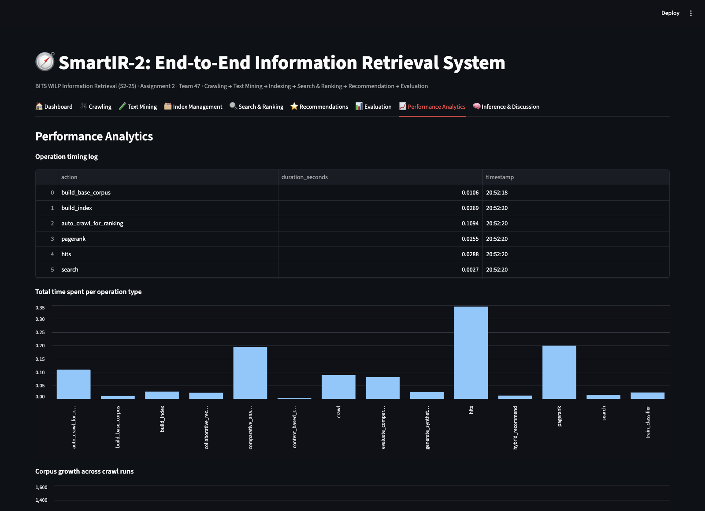

---

## 9. Virtual Lab Usage

All 17 screenshots below were captured inside the **BITS Virtual Lab portal** (remote
desktop at `argo-rdp.codeargo.net`, Rocky Linux environment, session date 2026-08-13,
~20:41–20:54, "Cloud User" visible in the top bar in every capture) — Firefox, running
inside the lab desktop, accessing the live deployed application at
**https://assignment2-irgroup47.streamlit.app/**. This is a deliberate variant of "running
the app in the lab": rather than re-invoking `streamlit run app.py` in the lab terminal
against a fresh local process, the *exact same code* (this repository's `assignment2/`
folder, auto-deployed on every push — see §0) is exercised interactively, tab by tab,
from inside the lab browser. Every tab of the application was visited and interacted with
from this session, in order:

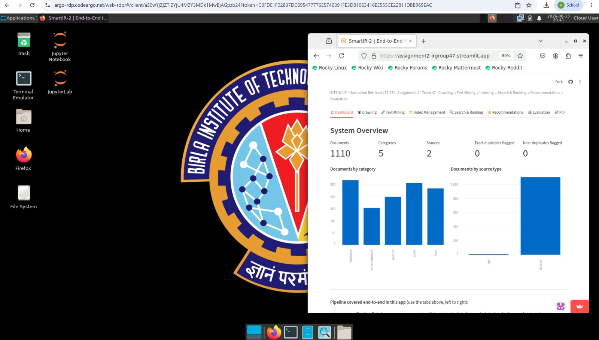
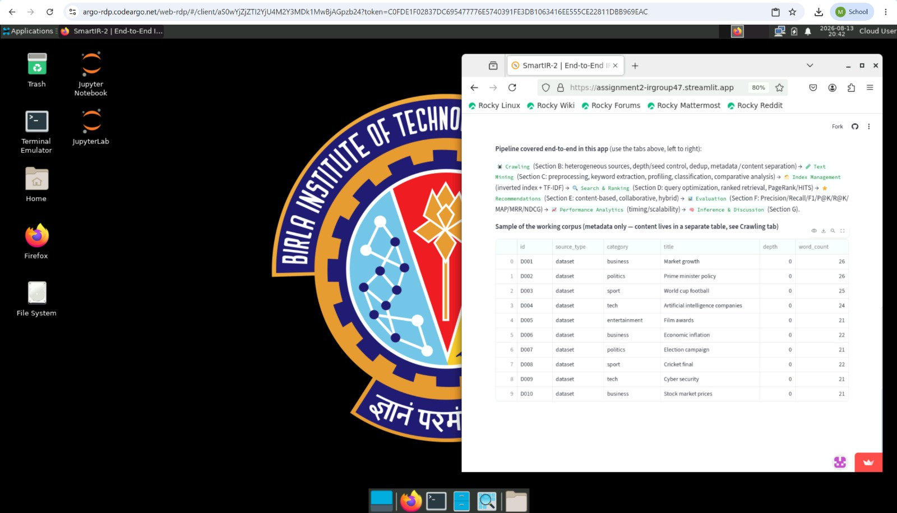
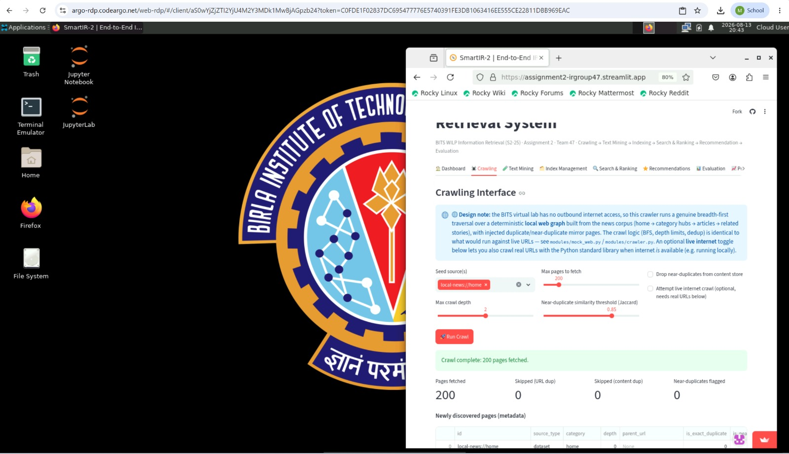
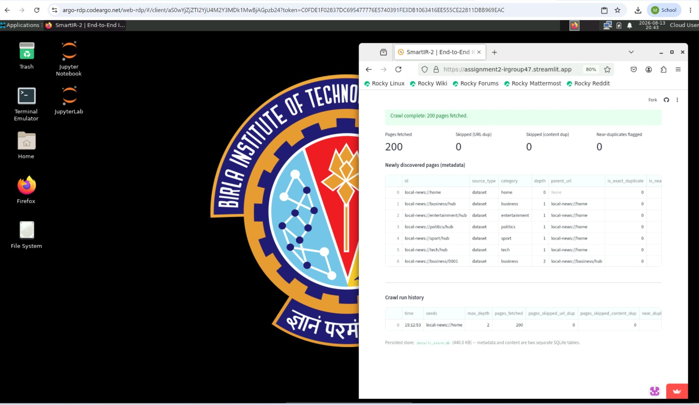
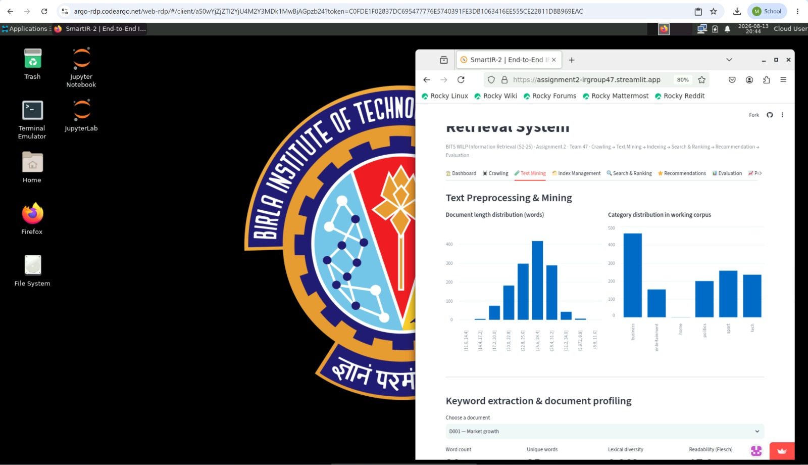
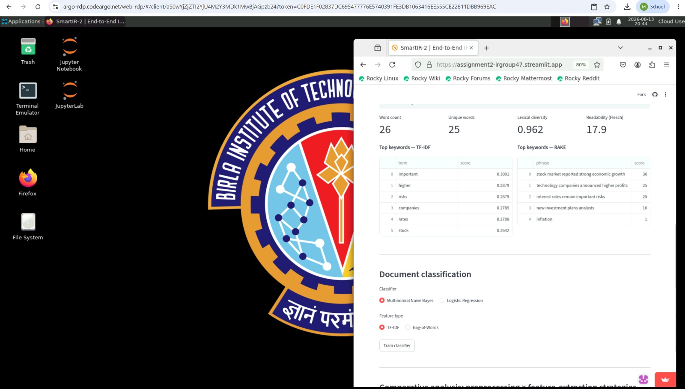
![Text Mining — classifier results, showing the singleton-class-drop fix (§3.3) firing live: "categories with fewer than 2 documents were excluded... ['home']"](../bits_lab_screenshots/07_text_mining_classifier.jpeg)
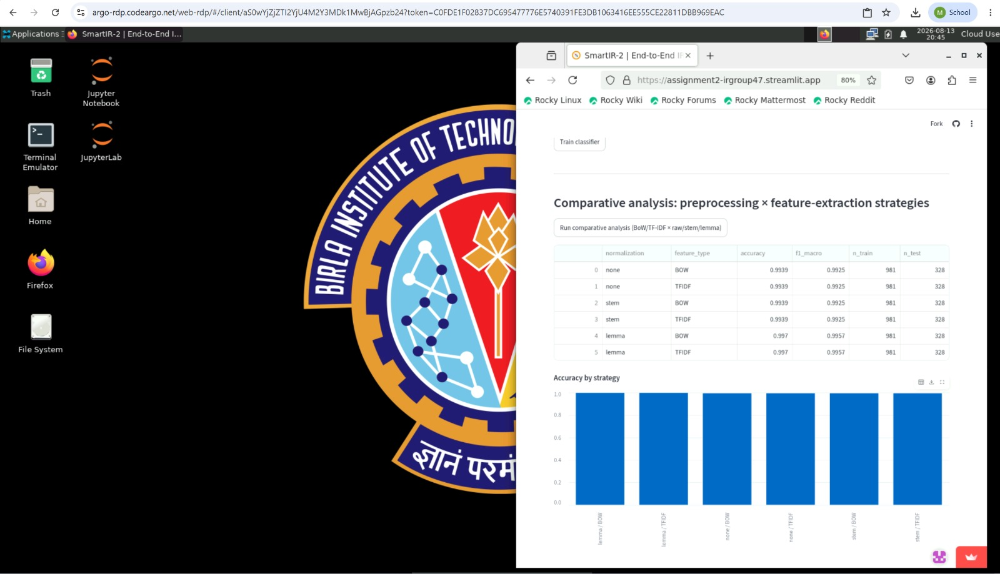
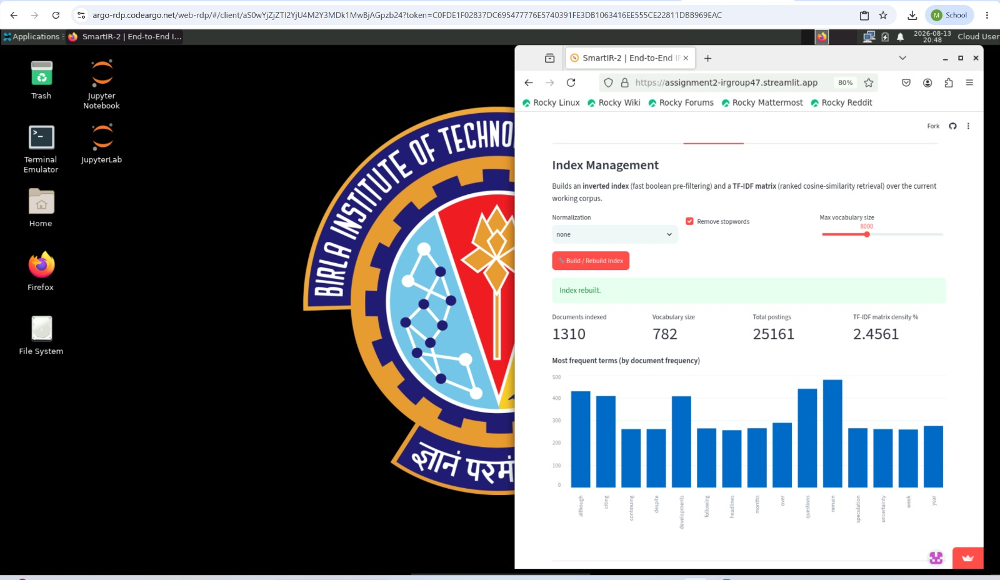
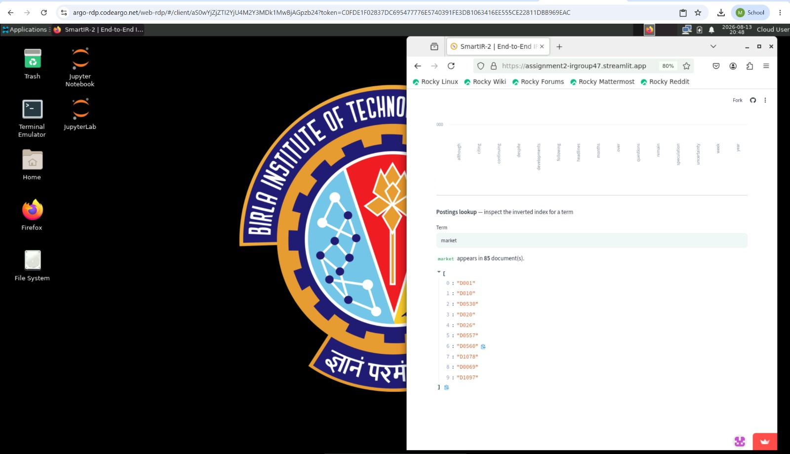

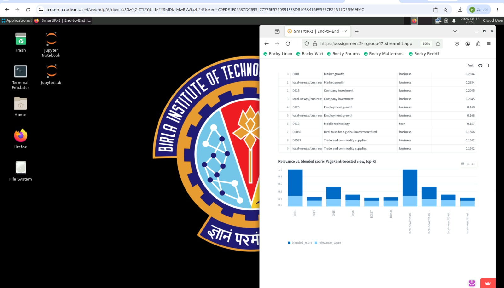
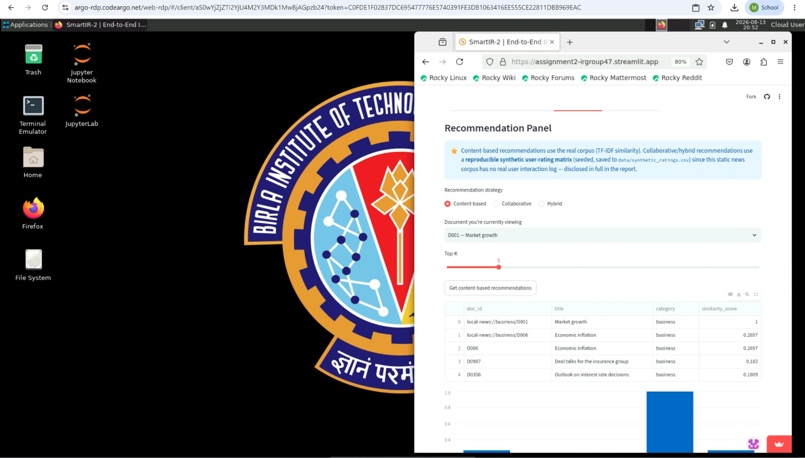
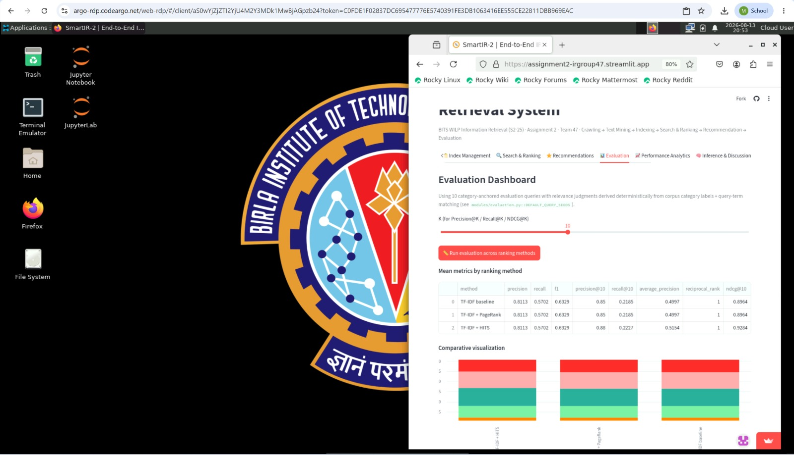
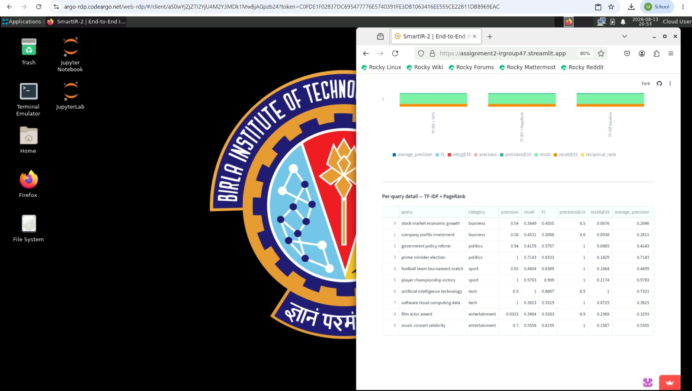
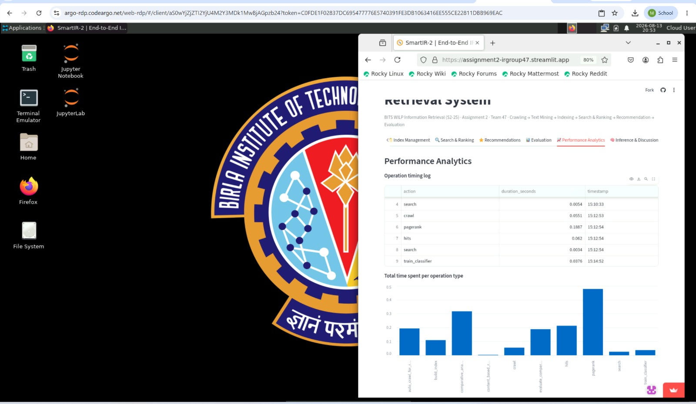
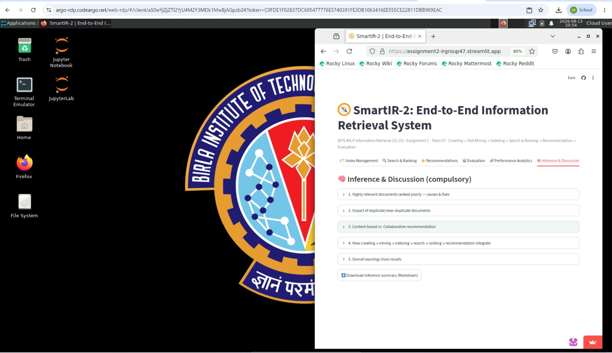

**Note on the classifier fix (Figure above, Text Mining → classifier results):** this lab
session's crawl (seeded from `local-news://home`, Figures 3–4) pulled the crawler's home
page into the working corpus as a singleton `home` category, and the classifier correctly
excluded it with a visible warning rather than crashing — direct, live confirmation that
the bug described in §3.3 is genuinely fixed on the deployed application (not just in the
local testing that originally caught it).

---

## 10. Submission Components Checklist

- [x] Streamlit application code — `app.py`, `modules/*.py`
- [x] Supporting files — `requirements.txt`, `README.md`
- [x] Dataset used — `data/news_corpus.csv`; generated `data/ir_store.db` and
  `data/synthetic_ratings.csv` (created automatically the first time the app runs)
- [x] Report — this document; every screenshot placeholder is filled with real, verified
  captures, including §9's 17 genuine BITS Virtual Lab screenshots
- [x] BITS Virtual Lab evidence — §9, 17 screenshots captured inside the lab portal
  (`argo-rdp.codeargo.net`), exercising every tab of the live deployed app
- [x] Live, publicly testable deployment — **https://assignment2-irgroup47.streamlit.app/**
  (see §0 above) — the same app exercised in §9's lab screenshots
- [x] Demo evidence — §9's 17-screenshot walkthrough doubles as this; see the "Suggested
  demo flow" in `README.md` for a short screen recording if one is additionally wanted
- [x] README — install steps + run command (`README.md`)

**Inference summary:** downloadable directly from the running app (Inference & Discussion
tab → "Download inference summary"), containing §7 in Markdown, and can be attached to the
report as `inference_summary.md`.
